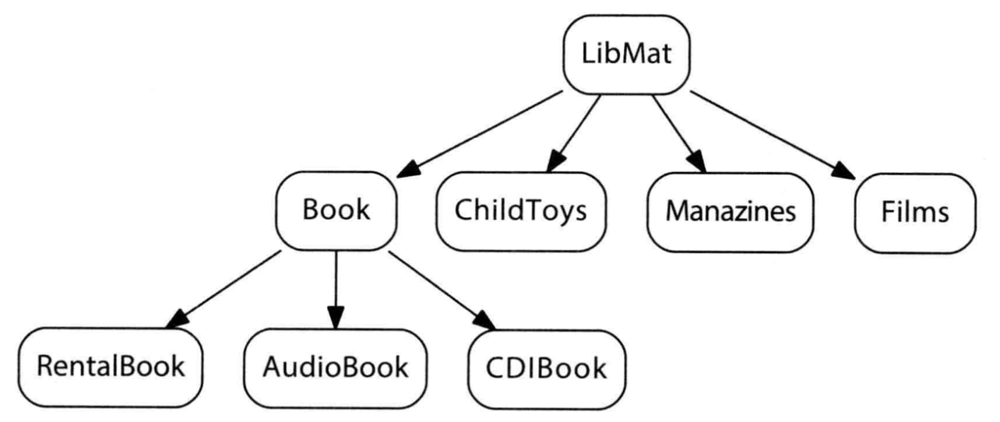

## 5 面向对象的编程风格

### 5.1 面向对象编程的概念

1. 面向对象编程两项最主要特质
    - 继承（**inheritance**）：将一群相关的类组织起来，分享其间共同数据和操作行为
    - 多态（**polymorphism**）：使得在类之上编程时，可以如同操作单一个体，而非相互独立的类；有更多弹性来加入或移除任意特定的类
    
2. 继承机制定义父子（parent-children）关系
    - 父类（parent）定义所有子类（children）所有公共接口（public interface）和私有实现（private implementation）
    - 每个 children 都可以增加或覆盖（override）继承而来的东西
    - 称父类为基类（**base class**），称子类为派生类（**derived class**），父类和子类之间的关系称为继承体系（inhertance hierarchy）

---

3. 继承体系中最根本的类——抽象基类（**abstruct base class**），其用来定义共同操作行为。如下图中的 `LibMat`

    

---

4. 面向对象应用程序中，会间接利用 “指向抽象基类” 的 pointer 或 reference 来操作系统中的各对象（而不操作各个实际对象）。

    ```cpp
    void loan_check_in(LibMat &mat) {
        // mat 实际上代表某个派生类对象 (derived class obj), 如上图中的 Book...
        mat.check_in();
        // 被调用的 check_in() 函数被解析 (resolved) 为 mat 所代表实际对象所用的有的 check_in() 函数
        if (mat.is_late())
            mat.assess_fine();
        if (mat.waiting_list())
            mat.notify_available();
    }
    // 每当 loan_check_in() 被调用, mat 必定指向程序中某个实际对象
    ```

    - 这使得在不更改旧有程序的前提下，加入或移除任何一个派生类
    - 此程序中不存在 `LibMat`对象，只有 `Book`，`rentalBook`等类对象

---

5. 多态：让基类的 pointer 或 reference 得以十分透明地指向其任何一个派生类对象。

    - 上述 `loan_check_in()`中， `mat`总是指向（代表）`LibMat`的某个派生对象（指向哪一个不定）

6. 面向对象第三个独特概念——动态绑定（dynamic binding）

    - 非面向对象

        ```cpp
        mat.check_in();	// 在程序执行之前就已经解析出应该调用哪一个函数, 其是静态绑定 (static binding)
        ```

    - 在面向对象编程中，编译器无法得知哪一份 `check_in()` 被调用。‘找出实际被调用的究竟是哪一个派生类的 `check_in()函数` 这一解析操作会延迟至运行时（run-time）才进行——动态绑定 